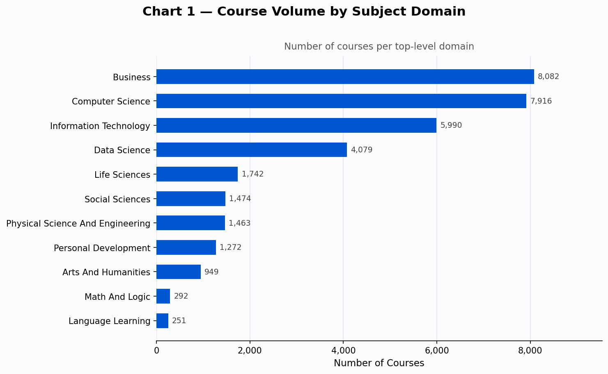
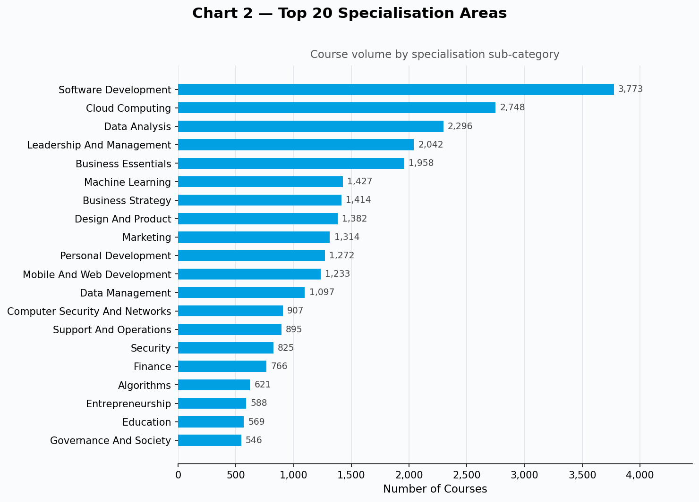
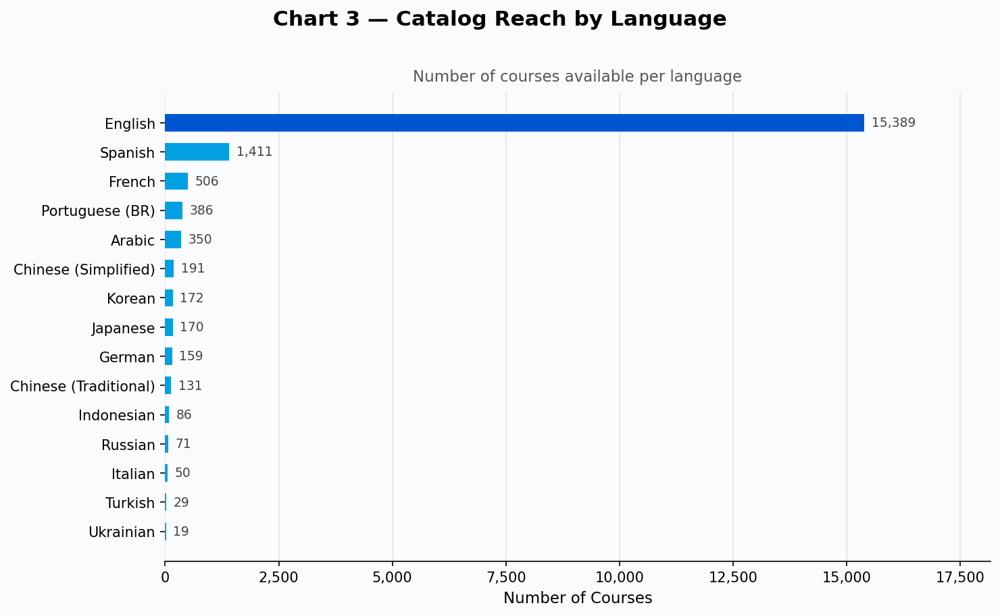
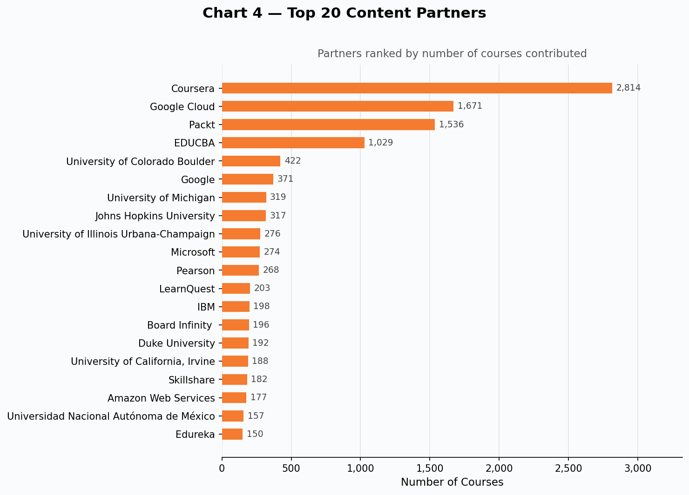
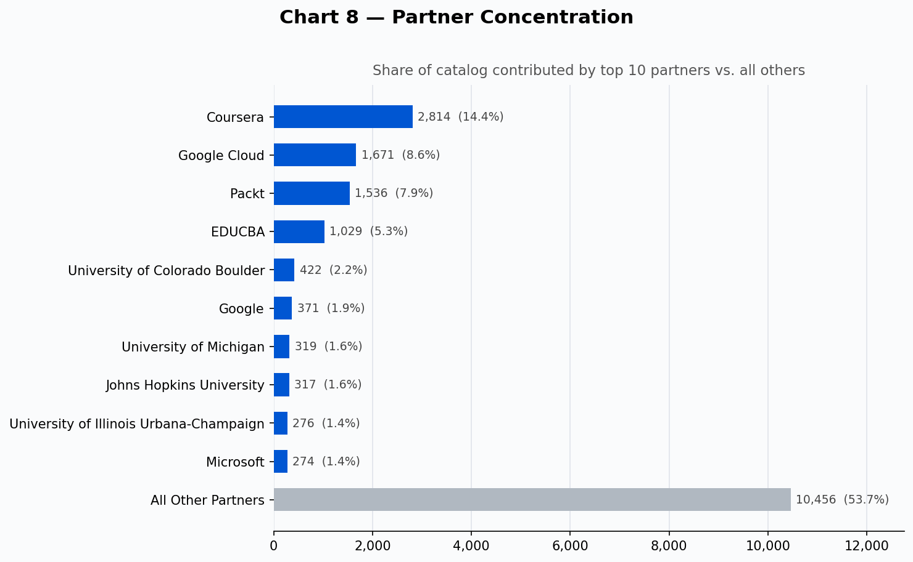
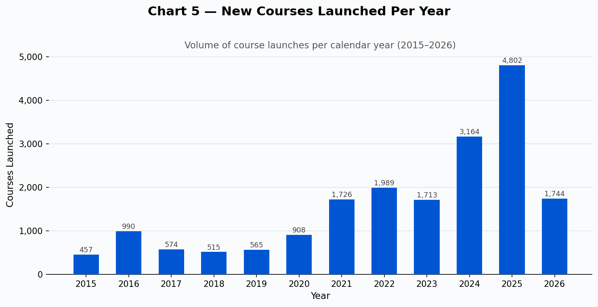
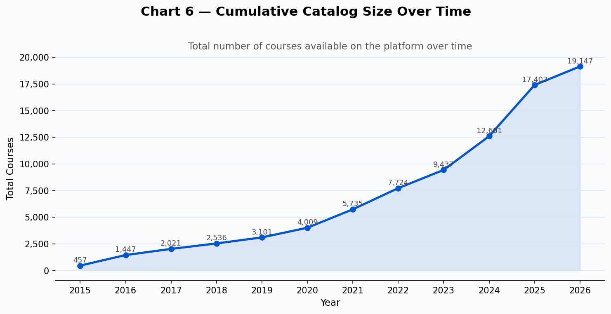
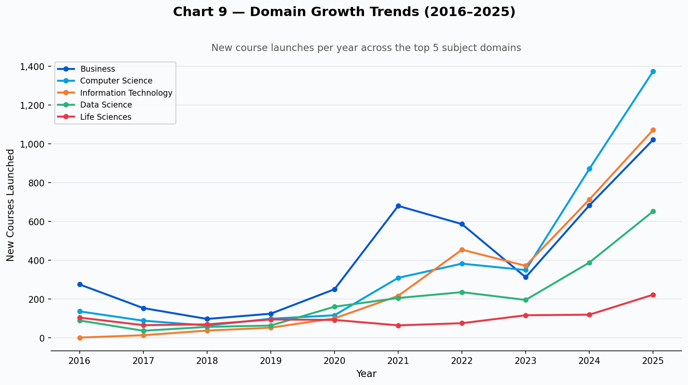
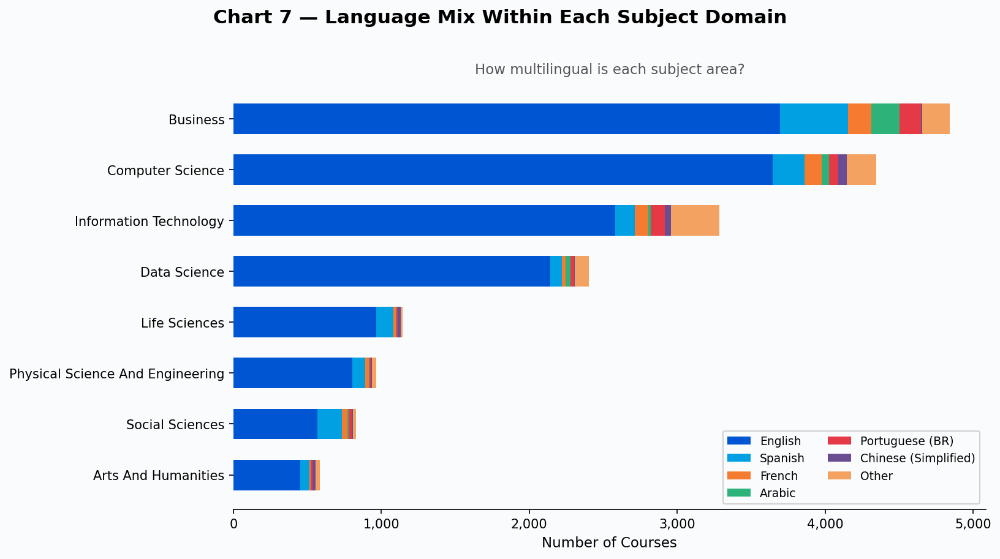

# Coursera Catalog — Business Intelligence Report

- > **Scope:** Analysis of 19,166 Coursera courses as of February 2026.
- > **Audience:** Executive leadership, product owners, and business managers.
- > **Data source:** Coursera public catalog API.

---

## Executive Summary

Coursera's catalog has grown from roughly 460 courses in 2015 to over 19,000 today — a **42× expansion** in a decade. The platform is heavily concentrated in Business and Technology, led by a small number of high-volume partners, and serves a predominantly English-speaking audience. Four strategic themes emerge from the data:

1. **Technology is overtaking Business** as the fastest-growing segment.
2. **80% of the catalog is English-only** — a significant gap given global learner demand.
3. **Ten partners supply nearly half of all content**, creating concentration risk.
4. **Growth has accelerated sharply** since 2021, with 2025 alone adding 4,800+ new courses.

---

## Finding 1 — Business and Technology Dominate the Catalog

**What the chart shows:** Business (8,082 courses) and Computer Science (7,916) are the two largest subject domains — together they account for more than 80% of the entire catalog. Information Technology (5,990) and Data Science (4,079) round out the top four.

**Why it matters:** The catalog is a direct reflection of where learner and employer demand exists. The near-equal weighting of Business and Computer Science signals that Coursera serves both the traditional workforce-development market and the rapidly expanding tech-skills market simultaneously. Life Sciences, Social Sciences, and Engineering are present but significantly smaller — representing either underserved demand or deliberate scope boundaries.

**Decision implication:** Any new content investment or partner recruitment effort should acknowledge that Business and Technology will continue to attract the most learners. Niche domains (Math & Logic, Arts & Humanities) may offer differentiation but require targeted go-to-market strategies.

---

## Finding 2 — Software, Cloud, and Data Lead at the Skill Level

**What the chart shows:** At a more granular level, Software Development (3,773), Cloud Computing (2,748), and Data Analysis (2,296) are the three largest specialisation areas. Leadership & Management (2,042) and Business Essentials (1,958) are the strongest non-technical categories.

**Why it matters:** This distribution maps almost exactly to the roles employers report as hardest to fill: software engineers, cloud architects, data analysts, and managers. The catalog is well-calibrated to current labour market needs at the skill level, not just the subject level.

**Decision implication:** Partners and course creators in Cloud Computing and Machine Learning are in a strong competitive position. Organisations designing learning paths for employees should consider whether their internal programs cover these same priority areas — or whether they can leverage the Coursera catalog as a complement.

---

## Finding 3 — English-Only Catalog Leaves 20% of Demand Underserved

**What the chart shows:** 15,389 courses (80.3%) are available only in English. Spanish is the second largest language at just 1,411 courses (7.4%), followed by French (2.6%), Portuguese (2.0%), and Arabic (1.8%). Combined, all non-English languages represent fewer than 3,800 courses.

**Why it matters:** The global online learning market is growing fastest in Latin America, the Middle East, and Southeast Asia. A catalog that is 80% English creates a ceiling on addressable learner volume in these regions. Competitors investing in localisation earlier will gain a structural advantage in market share.

**Decision implication:** Spanish, Portuguese (Brazil), and Arabic represent the highest-return localisation investments — they have existing content foundations and large, underserved learner populations. Doubling the Spanish catalog, for example, would directly address the world's second-largest internet-using language community.

---

## Finding 4 — Ten Partners Supply Nearly Half the Catalog

**What the charts show:** The top 10 content partners — Coursera itself (2,814 courses), Google Cloud (1,671), Packt (1,536), EDUCBA (1,029), University of Colorado Boulder (422), Google (371), University of Michigan (319), Johns Hopkins University (317), University of Illinois Urbana-Champaign (276), and Microsoft (274) — together contribute **46.3%** of all courses. The remaining 53.7% is spread across 91 additional partners.

**Why it matters:** A catalog where half the content comes from 10 suppliers carries meaningful concentration risk. If any top-three partner (Coursera, Google Cloud, Packt) were to withdraw or shift terms, the catalog would lose a significant portion of its most-accessed content overnight. At the same time, the long tail of 91 smaller partners suggests healthy ecosystem diversity beneath the top tier.

**Decision implication:** Supply chain risk management should include formalised content SLAs and exclusivity or preference arrangements with the top 5 partners. Simultaneously, diversification efforts should prioritise identifying and elevating mid-tier partners — organisations in the 50–200 course range — to reduce dependency on any single supplier.

---

## Finding 5 — Catalog Growth Has Accelerated Dramatically Since 2021

**What the charts show:** Course launches grew steadily at roughly 500–900 per year from 2015 to 2020. Starting in 2021 (1,726 launches), growth nearly doubled each year, reaching **4,802 new courses in 2025 alone** — the highest annual volume in the platform's history. The cumulative catalog crossed 10,000 courses in 2023 and has since grown by nearly 10,000 more in under two years.

**Why it matters:** The acceleration reflects both supply-side expansion (more partners, lower production costs with AI-assisted content creation) and demand-side growth (remote work, upskilling mandates, employer-funded learning benefits). This pace of growth also means that catalog quality assurance, discoverability, and learner curation are becoming more critical — a 19,000-course catalog is only valuable if learners can find the right course efficiently.

**Decision implication:** The platform is approaching a scale where breadth is no longer a differentiator. The next competitive advantage will come from curation, recommendation quality, and credential recognition — not simply having more courses. Investment in search, personalisation, and learning outcome validation will deliver more value than adding further catalog volume.

---

## Finding 6 — Technology Subjects Are Pulling Ahead of Business in Growth Rate

**What the chart shows:** From 2016 to 2019, Business was the clear catalog leader. Starting in 2021, Computer Science and Information Technology both began growing faster — in 2025, Computer Science (1,374 new courses) and Information Technology (1,072) each surpassed Business (1,021) in annual launch volume for the first time.

**Why it matters:** This shift reflects a structural change in learner demand: employers are increasingly requiring demonstrable technical skills, not just business credentials. The reversal of the Business/Technology growth ratio is a leading indicator that the economic value of tech-focused credentials is rising relative to general business qualifications.

**Decision implication:** Content strategy, partner recruitment, and marketing messaging should increasingly lead with technical skill outcomes. Certificates and specialisations in cloud, AI, cybersecurity, and software development are likely to show higher completion rates, better employer placement outcomes, and stronger willingness to pay — all of which improve the business case for content investment in these areas.

---

## Finding 7 — Multilingual Offerings Are Concentrated in Business Subjects

**What the chart shows:** When language is layered onto subject domains, Business is the most multilingual — it has the largest share of Spanish, French, and Portuguese content of any domain. Technology domains (Computer Science, Information Technology) are overwhelmingly English-only.

**Why it matters:** Non-English learners who want technology skills have very limited options on the platform today. The combination of fast-growing technology demand and near-zero non-English technology content is the single largest unmet need visible in the catalog data.

**Decision implication:** The highest-value content gap to close is **non-English technology courses** — specifically Spanish and Portuguese cloud, software development, and data analysis content. This intersection targets high-demand skills in high-growth markets where competition is currently lowest.

---

## Strategic Recommendations at a Glance

| Priority | Recommendation | Supporting Finding |
|---|---|---|
| **High** | Invest in Spanish and Portuguese technology content | Findings 3 & 7 |
| **High** | Formalise supply agreements with top 5 partners | Finding 4 |
| **High** | Shift from catalog growth to curation and discovery | Finding 5 |
| **Medium** | Recruit cloud, AI, and cybersecurity partners | Findings 2 & 6 |
| **Medium** | Build employer credential partnerships for tech skills | Finding 6 |
| **Lower** | Explore niche domain expansion (Math, Engineering) | Finding 1 |

---

## Data & Methodology Notes

- Dataset: 19,166 courses sourced from the Coursera public catalog API (February 2026).
- Course counts per domain and language are based on a course's primary classification; a course tagged with two domains is counted once per domain.
- Partner counts reflect all courses associated with each partner ID.
- Year of launch is derived from each course's recorded start date.
- Charts generated with Python (matplotlib). All charts are in the `charts/` directory.

---

*Report prepared February 2026.*
